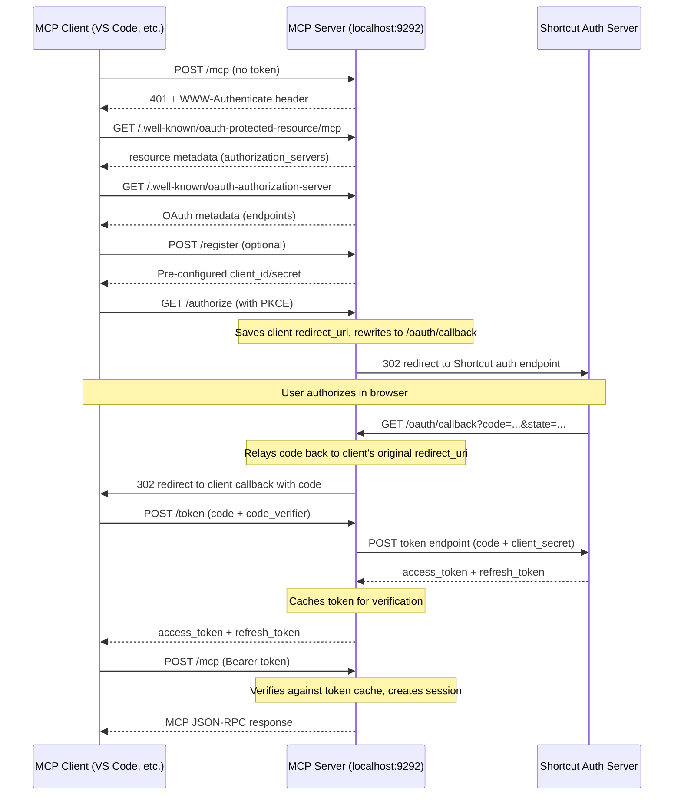

# OAuth Proxy Implementation

## Overview

The MCP HTTP server authenticates clients using OAuth 2.0 with PKCE, proxied through the Shortcut authorization server. The MCP server acts as both the OAuth authorization server (from the client's perspective) and an OAuth client (from the Shortcut auth server's perspective), using pre-configured client credentials.

This replaces the previous approach of direct API token authentication. The stdio server (`server.ts`) is unaffected -- OAuth is HTTP-only.

## Architecture



## Files Changed

| File | Change |
|------|--------|
| `src/auth/provider.ts` | New -- OAuth provider with callback proxy, token caching, auto-refresh |
| `src/server-http.ts` | Refactored -- uses SDK auth router, bearer auth middleware, callback relay, OAuth ShortcutClient |
| `src/client/shortcut.ts` | Minor -- added `updateClient()` method for token refresh |
| `src/auth/oauth.test.ts` | New -- 17 mocked unit tests |
| `src/auth/oauth-integration.test.ts` | New -- 7 integration tests (staging, opt-in) |

## Environment Variables

| Variable | Required | Default | Description |
|----------|----------|---------|-------------|
| `SHORTCUT_OAUTH_CLIENT_ID` | Yes | -- | Pre-registered OAuth client ID |
| `SHORTCUT_OAUTH_CLIENT_SECRET` | Yes | -- | Pre-registered OAuth client secret |
| `AUTH_SERVER` | No | `api.app.shortcut.com` | Shortcut auth/API server hostname |
| `MCP_SERVER_URL` | No | `http://localhost:9292` | Public URL of this MCP server |
| `PORT` | No | `9292` | HTTP listen port |

The OAuth callback URL (`{MCP_SERVER_URL}/oauth/callback`) must be registered as an allowed redirect URI on the Shortcut auth server for the configured client ID.

## Provider (`src/auth/provider.ts`)

### `createOAuthProvider(options?)`

Factory function that returns an `OAuthProviderWithCallback` implementing the MCP SDK's `OAuthServerProvider` interface. All configuration is read lazily from environment variables (so tests can set env vars before calling the factory).

### Key behaviors

**Client registration:** Returns the pre-configured `client_id`/`client_secret` for any registration request. MCP clients that skip `/register` (like VS Code on reconnect) still work because `getClient` accepts any `redirect_uri` via a Proxy array.

**Authorization (callback proxy):** The `/authorize` handler does NOT forward the client's `redirect_uri` to the upstream Shortcut auth server. Instead:
1. Saves the client's original `redirect_uri` keyed by `state`
2. Redirects to Shortcut with `redirect_uri` set to `{MCP_SERVER_URL}/oauth/callback`
3. The `/oauth/callback` route (mounted in `server-http.ts`) receives the auth code from Shortcut and relays it back to the client's original redirect URI

This is necessary because MCP clients (VS Code, MCP Inspector) use ephemeral localhost ports as callback URLs, which can't be pre-registered with the Shortcut auth server.

**Token exchange:** Proxies `authorization_code` and `refresh_token` grants to the Shortcut token endpoint, injecting the `client_secret` (since the auth method is `client_secret_post`). The `redirect_uri` sent upstream is always the MCP server's callback URL (matching what was used during authorization). Tokens returned from the exchange are cached for verification.

**Token verification:** Three-tier approach:
1. **Cache hit (not expired):** Return immediately -- trusted because we issued it
2. **Cache hit (near-expiry or expired):** Auto-refresh using the stored `refresh_token`, update cache, return new token
3. **Cache miss:** Fall back to calling `ShortcutClient.getCurrentMemberInfo()` for legacy API token verification

**Token cache:** In-memory `Map<string, TokenCacheEntry>` storing `access_token`, `refresh_token`, `expiresAt`, `clientId`, and `scopes`. Default TTL is 120 seconds (since Shortcut's token endpoint may not return `expires_in`). Tokens are refreshed 60 seconds before expiry. After refresh, both old and new tokens map to the same entry so stale client tokens still resolve.

### Testability

All dependencies are injectable via `CreateOAuthProviderOptions`:

```typescript
createOAuthProvider({
  endpoints: { authorizationUrl, tokenUrl },
  verifyAccessToken: mockFn,
  getClient: mockFn,
  clientInfo: { client_id, client_secret, redirect_uris },
  fetch: mockFetch,
  mcpServerUrl: "http://localhost:0",
});
```

## HTTP Server (`src/server-http.ts`)

### SDK integration

The server uses three components from the MCP SDK:

- **`mcpAuthRouter`** -- Express middleware that installs OAuth endpoints at the app root:
  - `GET /.well-known/oauth-protected-resource/mcp` (resource metadata)
  - `GET /.well-known/oauth-authorization-server` (authorization server metadata)
  - `GET /authorize` (authorization endpoint)
  - `POST /token` (token endpoint)
  - `POST /register` (dynamic client registration)

- **`requireBearerAuth`** -- Express middleware that validates `Authorization: Bearer` tokens on `/mcp` routes. Calls `provider.verifyAccessToken()`, which triggers the cache/refresh logic.

- **`getOAuthProtectedResourceMetadataUrl`** -- Helper to construct the RFC 9728 metadata URL for the `WWW-Authenticate` header.

### Callback relay route

Mounted at `GET /oauth/callback` (from `provider.callbackPath`). Receives the authorization code from the Shortcut auth server, looks up the original client redirect URI from `provider.pendingAuthorizations`, and redirects back to the client with the code and state.

### ShortcutClient for OAuth tokens

The standard `ShortcutClient` sends tokens via the `Shortcut-Token` header, which doesn't work with OAuth access tokens. The `createOAuthShortcutClient()` helper:

1. Creates a `ShortcutClient` with the correct `baseURL` (derived from `AUTH_SERVER`)
2. Adds an `Authorization: Bearer` header
3. Removes the `Shortcut-Token` header from axios defaults (the Shortcut API rejects requests with an invalid `Shortcut-Token` even when a valid Bearer token is present)

### Token refresh in sessions

When `requireBearerAuth` auto-refreshes a token, `req.auth.token` contains the new token. The `handleMcpPost` handler detects the change (`accessToken !== session.accessToken`) and calls `session.clientWrapper.updateClient()` to swap the underlying `ShortcutClient` so tools use the fresh token.

## ShortcutClientWrapper (`src/client/shortcut.ts`)

Added `updateClient(newClient)` method that swaps the internal `ShortcutClient` instance. Clears the cached current user but preserves entity caches (users, teams, workflows, custom fields) since the refreshed token belongs to the same user.

## Tests

### Mocked unit tests (`src/auth/oauth.test.ts`)

17 tests running against a real Express server (random port) with mocked upstream fetch. Uses Bun's test runner.

| Group | Tests |
|-------|-------|
| Metadata Discovery | Protected resource metadata, authorization server metadata, registration endpoint presence |
| Client Registration | Returns pre-configured credentials, idempotent across calls |
| Authorization Flow | Redirect to upstream with PKCE params, error on missing params |
| Token Exchange | Authorization code exchange, client_secret_post verification, refresh token grant |
| Protected MCP Endpoint | 401 without token, 200 with valid token, 401 with invalid token, unauthenticated GET/DELETE, health unprotected |
| Full Flow | End-to-end: discovery -> register -> authorize -> token -> authenticated MCP request |

### Integration tests (`src/auth/oauth-integration.test.ts`)

7 tests against the real staging auth server. Skipped by default; enabled with `RUN_INTEGRATION_TESTS=true`.

| Group | Tests |
|-------|-------|
| Metadata Discovery (live) | Local server metadata, staging auth server metadata |
| Authorization URL (live) | Redirect to staging with correct params |
| Token Exchange (live) | Requires `TEST_AUTH_CODE` env var |

## Known Limitations

- **In-memory token cache:** Tokens don't survive server restarts. Clients must re-authorize after restart.
- **Single OAuth client identity:** All MCP clients share the same `client_id`/`client_secret`. Per-client registration is not supported.
- **No token introspection:** Token validity relies on the cache TTL and refresh, not on Shortcut's introspection endpoint (which may not exist).
- **Shortcut-Token header workaround:** The `createOAuthShortcutClient` helper deletes axios internal headers, which is fragile if the `@shortcut/client` library changes its internals.
